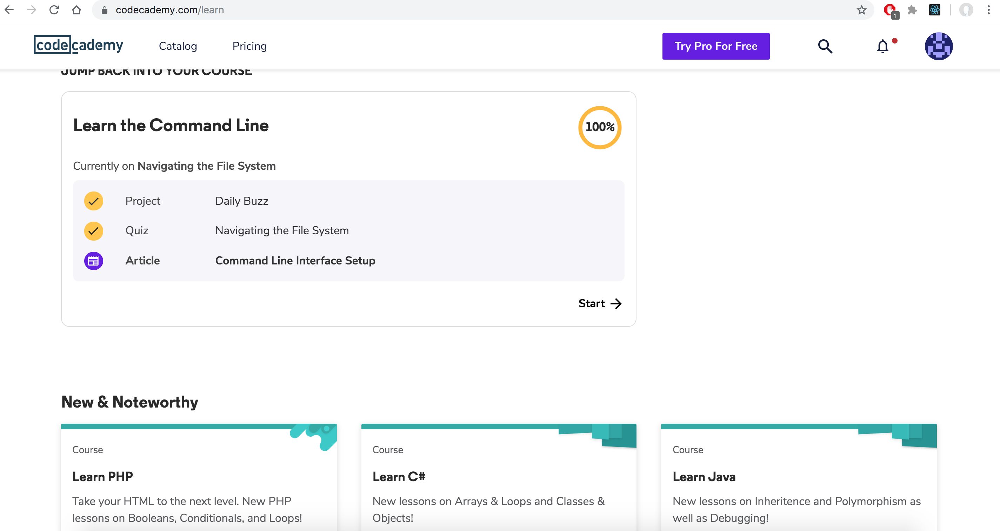

# kottans-backend

## Unix Shell

**What was new: **
-How to create and use bash scripts 
-A lot of shell commands like cat, tail, grep etc. 
-File permissions - what they mean and how change them 
-Navigation in file system 

**What was interesting: **

-file permissions 
-writing bash scripts 

**What I will use: **
-I hope all of that)

## Git Collaboration
Already done in front-end course

https://github.com/Karasb888/kottans-frontend